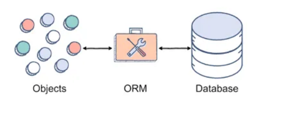
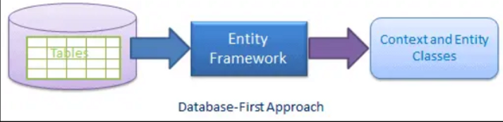
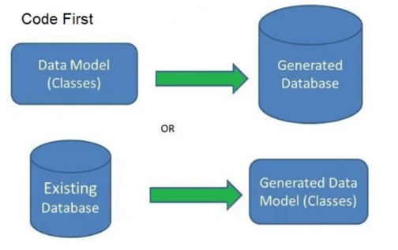
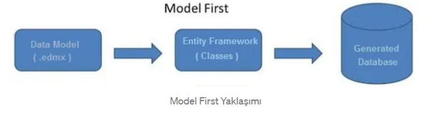

# :triangular_flag_on_post: ORM ve Hibernate 

<b> ORM , ( Object to Relational Mapping ) Nesne ile İlişkisel Eşleme olarak açabiliriz. ORM
ilişkisel veri tabanı ile uygulamamız arasında bir köprü görevi gören, ilişkileri ve nesneleri yönetmek için kullanılan bir tekniktir.</b>



## 🎯 :green_circle: ORM araçlarının avantajları  

- Database teknolojisine olan bağımlılığını ortadan kaldırır. Uygulama sadece ORM'i bilir. Database hakkında fikri yoktur.
- SQL/TSQL/PLSQL bilmeden çok kısa bir zamanda db işlemlerini çok daha az kod yazarak yapabilirsiniz.
- Nesne yönelimli kod yazmayı destekler.
- ORM Araçlarının çoğu açık kaynak kodludur.


## 🎯 :red_circle: ORM araçlarının dezavantajları 

- Performans sorunları yaratabilir. DB'ye bağlanıp sql çalıştırmak her zaman için daha performanslıdır.
- Orm araçlarının oluşturduğu sql lere müdahale edemezsiniz. Kontrolü developer'dan alır.
- Orm aracını öğrenmek için de zamana ihtiyacınız vardır.


### ORM modelleme yaklaşımları 3'e ayrılır:

1. DB First Yaklaşım
2. Code First Yaklaşım
3. Model First Yaklaşım
 

### 🎯 1. Database First Yaklaşım

> Database First yaklaşımda var olan bir veri tabanından modeli .EDMX uzantılı dosya olarak oluşturur.
>Bu yaklaşımda veri tabanında değişiklikler yapmak istendiğinde, SQL server da manuel olarak değişiklikler yapıldıktan sonra modele aktarılır.




### 🎯 2. Code First Yaklaşım

> Code First, kod ile veri tabanı ve entity modeli oluşturma yaklaşımıdır. Öncelikle entity classları oluşturulur, classlar arası ilişkiler belirlenir. Daha sonra classlar tablo olarak, classlardaki propertyler ise kolon olarak veri tabanına aktarılır.
> Code First yaklaşımında EDMX desing yapılmaz.




### 🎯 3. Model First Yaklaşım

> Model First yaklaşımında önce yeni bir model oluşturmaya daha sonra o modelden bir veri tabanı şeması oluşturmaya izin verir.
> Model bir .EDMX dosyasında saklanır. Bu yaklaşımda entity’leri, ilişkileri vb. EDMX design da oluşturmalı ve daha sonra modelden veri tabanı oluşturulmalıdır.



</b>
# :triangular_flag_on_post: Hibernate Nedir?

**Hibernate java**geliştiriciler için geliştirilmiş bir **ORM** kütüphanesidir. nesne yönelimli modellere göre veritabanı ile olan ilişkiyi sağlayarak,veritabanı üzerinde yapılan işlemleri kolaylaştırmakla birlikte kurulan yapıyı da sağlamlaştırmaktadır.

**Hibernate** kullanmadan **JDBC** ile veri tabanına erişmek mümkündür. Ancak veri tabanındaki tablo sayısı arttığında buna bağlı olarak tablolar arası ilişkiler de artacaktır. Uygulama büyüdükçe bu ilişkiler çok karmaşık bir hal alabilir.

**Hibernate** verinin kalıcı (persistence) olmasını sağlamak için veritabanına karşılık gelen sınıfları ve bu sınıfların konfigurasyon dosyalarını kullanır. Ayrıca hangi veritabanına nasıl bağlanılacağı bilgilerinin tutulduğu bir XML dosyası da vardır. Sınıflar için kullanılan konfigurasyon dosyalarında hangi sınıfı veritabanındaki hangi tabloya karşılık geldiği bilgileri ile kolon bilgileri tutulur. Sınıflar için kullanılan bu konfigurasyon dosyaları eskiden bir metin dosyasında saklanırke şimdi Annotation
lar ile ifade edilmektedir.

<i>Maven-Hibernate ile veritabanı işlemi yapabilmemiz için belli başlı bağımlılıklar ve
hibernate xml dosyasına ihtiyacımız  bu dosyayı main altında **resources** kısmına ekliyoruz. Bu hibernate.cfg.xml dosayasını inceleyecek
olursak mysql bağlantısı yapabileceğimiz bir driver,url,username,password gibi bilgieri girerek mysql bağlantısını oluşturuyoruz.</i>

```xml
<?xml version="1.0" encoding="UTF-8"?>
<!DOCTYPE hibernate-configuration PUBLIC
        "-//Hibernate/Hibernate Configuration DTD 3.0//EN"
        "http://hibernate.org/dtd/hibernate-configuration-3.0.dtd">
<hibernate-configuration>
    <session-factory>
        <property name="hibernate.connection.driver_class">com.mysql.jdbc.Driver</property>
        <property name="hibernate.connection.url">jdbc:mysql://localhost:3306/test?useUnicode=true&amp;useLegacyDatetimeCode=false&amp;serverTimezone=Turkey</property>
        <property name="hibernate.connection.username">root</property>
        <property name="hibernate.connection.password">****</property>
        <property name="hibernate.connection.pool_size">1</property>
        <property name="hibernate.current_session_context_class">thread</property>
        <property name="hibernate.show_sql">true</property>
        <property name="hibernate.dialect">org.hibernate.dialect.MySQLDialect</property>
    </session-factory>
</hibernate-configuration>
```

<b>Bunlar tek başına yeterli olmayacaktır hibernate ve mysql'i görebilmesi için bağımlıkık eklememiz gerekiyor</b>
#### :pushpin: Hibernate Dependency
```xml
    <dependency>
      <groupId>org.hibernate</groupId>
      <artifactId>hibernate-core</artifactId>
      <version>5.6.14.Final</version>
    </dependency>
```

#### :pushpin: MySql Dependency

```xml
    <dependency>
      <groupId>mysql</groupId>
      <artifactId>mysql-connector-java</artifactId>
      <version>8.0.28</version>
    </dependency>
```


 


